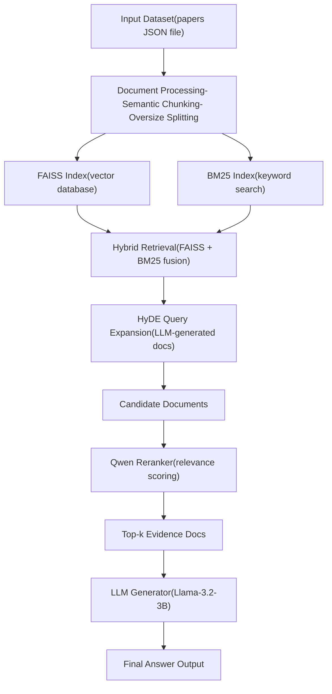

#  Document QA based on RAG

A scalable Retrieval-Augmented Generation (RAG) system for academic papers, featuring hybrid retrieval (FAISS + BM25), HyDE query expansion, LLM-based reranking, and a persistent vector/database storage layer.

---
## 🗂️ Project Structure

```
PaperRAG/
│
├── data/
│   ├── private_dataset.json      # Input dataset (papers, questions)
│   └── out.json                 # Output predictions
│
├── faiss_db/                    # Persisted vector database (auto-generated)
│
├── main.py                      # Entry point (this script)
│
├── config.py                    # Global configs (e.g., NUM_GPUS)
├── embeddings.py                # Embedding model + text splitter
├── indexer.py                   # Parallel indexing logic
├── pipeline.py                  # Core RAG pipeline
├── retriever.py                 # Hybrid retrieval (FAISS + BM25)
├── reranker.py                  # Reranker (Qwen-based)
├── HyDE.py                      # Query expansion (HyDE)
├── utils.py                     # JSON load/save utilities
│
└── README.md                    # Project documentation
```

---

##  Features

###  Hybrid Retrieval

* Dense retrieval (FAISS)
* Sparse retrieval (BM25)
* Score fusion with tunable `alpha`

###  Query Expansion

* HyDE (Hypothetical Document Embeddings)
* Improves recall by generating pseudo-documents

###  Reranking

* Cross-encoder reranker (Qwen-based)
* Improves precision of retrieved documents

###  LLM Answer Generation

* Uses HuggingFace pipeline (LLaMA-based)
* Deterministic generation (temperature = 0)

###  Parallel Indexing

* Multi-GPU indexing support
* Configurable worker count

---

##  System Architecture

---

##  Installation

```bash
pip install -r requirements.txt
```

---

##  Environment Setup

Create `api_key.env`:

```
HF=your_huggingface_token
```

---

##  Data Format

Input JSON structure:

```json
[
  {
    "title": "Paper Title",
    "question": "What is ...?",
    "full_text": "Full paper content ..."
  }
]
```

---

##  Usage

### Build Index

```bash
python main.py index
```

---

###  Run Query

```bash
python main.py query
```

---

##  Output Format

```json
[
  {
    "title": "...",
    "answer": "...",
    "evidence": ["chunk1", "chunk2"]
  }
]
```

---
##  Self-Scoring Script Usage

This script evaluates your RAG pipeline output against the public dataset using two metrics:

* **Evidence Score** → ROUGE-L (same as TA grading)
* **Correctness** → LLM-based judge (approximation)

---

###  Basic Usage

```bash
python score_public.py results.json
```

---

###  Optional Arguments

```bash
python score_public.py results.json
```

---

###  Arguments Description

| Argument    | Description                          |
| ----------- | ------------------------------------ |
| `results`   | Your prediction JSON file            |
| `--host`    | LLM server host (default: localhost) |
| `--port`    | LLM API port (default: 8091)         |
| `--model`   | Judge model (default: LLaMA-3.2-3B)  |
| `--dataset` | Public dataset path                  |
| `--times`   | Number of judge runs (majority vote) |

---

###  Input Format

```json
[
  {
    "title": "...",
    "answer": "...",
    "evidence": ["...", "..."]
  }
]
```

---

###  Output

* Console:

  * Per-paper scores
  * Running averages

* File:

  * `results_score.json`

```json
{
  "summary": {
    "evidence_score": 0.85,
    "correctness": 0.72
  },
  "per_paper": [...]
}
```

---

### ⚠️ Notes

* **Evidence Score** is identical to TA grading (reliable)
* **Correctness** is approximate (uses a smaller 3B model)
* Use this script for **development feedback**, not final score prediction


##  Core Pipeline Flow

1. Load paper dataset
2. Semantic chunking
3. Build FAISS + BM25 indexes
4. HyDE query expansion
5. Hybrid retrieval fusion
6. Reranking (Qwen)
7. Top-k selection
8. LLM generation (Llama)

---

##  Performance Design

* Multi-process indexing (`ProcessPoolExecutor`)
* GPU sharding for embeddings
* Cached vector + BM25 storage
* File locking for safe parallel writes
* Batch reranking inference

##  Evaluation (LLM as a Judge)

To assess answer quality, we adopt an **LLM-as-a-Judge** evaluation strategy, where a large language model evaluates the correctness and relevance of generated answers against reference outputs.

### Metrics

- **Accuracy**: 55%
- **ROUGE-L**: 0.27


